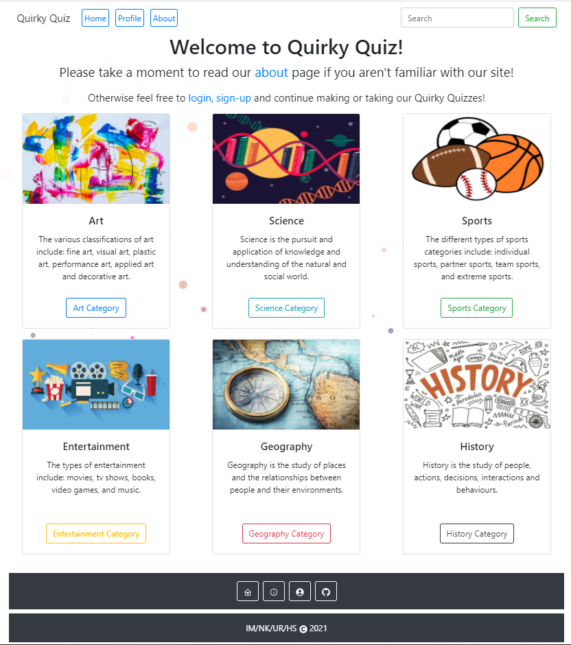

# Quirky Quiz

## Table of Contents

- [Description](#description)
- [Requirements](#requirements)
- [Installation](#installation)
- [Technologies Used](#Technologies)
- [Credits](#credits)

## Description

---

A web application that allows users to take silly quizzes on topics of their choice.
Created this using ReactJS and MySQL as the database.

Deployed Website:



## Requirements

---

```
* Must use ReactJS in some way
* Must use a Node and Express Web Server
* Must be backed by a MySQL or MongoDB database with a Sequelize or Mongoose ORM
* Must have both GET and POST routes for retrieving and adding new data
* Must deploy this application using Heroku with data. Follow our guide on [deploying MERN applications to Heroku](../04-Important/MERNHerokuDeploy.md) to do so.
* Must utilize at least 2 libraries, packages, or technologies that we haven't discussed
* Must allow for or involve the authentication of users in some way
* Must have a polished front end/UI
* Must have a folder structure that meets the MVC paradigm
* Must meet good quality coding standards (indentation, scoping, naming)
* Must protect API keys in Node with environment variables
## Presentation Requirements
Use this [project presentation template](https://docs.google.com/presentation/d/1_u8TKy5zW5UlrVQVnyDEZ0unGI2tjQPDEpA0FNuBKAw/edit?usp=sharing) to address the following:
* Elevator pitch: a one minute description of your application
* Concept: What is your user story? What was your motivation for development?
* Process: What were the technologies used? How were tasks and roles broken down and assigned? What challenges did you encounter? What were your successes?
* Demo: Show your stuff!
* Directions for Future Development
* Links to to the deployed application and the GitHub repository
## Grading Metrics
| Metric        | Weight |
| ---           | ---    |
| Concept       | 10%    |
| Design        | 20%    |
| Functionality | 30%    |
| Collaboration | 30%    |
| Presentation  | 10%    |
## Submission on BCS
You are required to submit the following:
* The URL of the deployed application
* The URL of the GitHub repository
```

## Installation

---

No installation needed for this project

See deployed site here: https://quirkyquiz.herokuapp.com

See repository here: https://github.com/ngkent75/quirky-quiz.git

## Technologies Used

---

- REACT
- Bootstrap
- Session
- MySQL

Any and all improvement suggestions are welcome!

## Credits

---

- [Haleigh Spurlock](https://github.com/haleighspurlock)
- [Ian Mcbrayer](https://github.com/ihm57511)
- [Nathan Kent](https://github.com/ngkent75)
- [Uriel Rosario](https://github.com/urielrosario)

&COPY;2021
